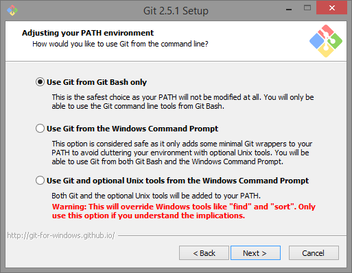
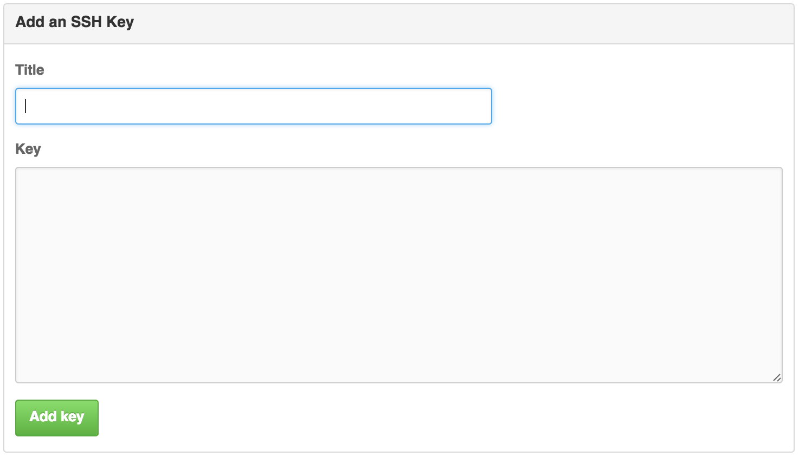

# Introduction to Github and Git

---

Welcome to BIO 260 and CSCI E107. In this lab we'll cover some basics of Github and Git, including installation instructions for git as well as a walk through on homework submission.

This lab is largely taken from the the [first CS109 lab in 2015](https://github.com/cs109/2015lab1) which is in turn largely taken from [IACS's AC 297s](https://github.com/rdadolf/ac297r-tools-tutorial) course, and the world keeps turning. 

##First Things

Do this now, the sooner we get your Github accounts and set up a working version of git the earlier we can spot and work through inevitable issues. 

###1. Create your github account

If you still do not have a github account as yet, create it at:

https://github.com

This step is **mandatory**. We will need your github username. We are using github for many aspects of this course, including

- doing and submitting homework
- collaborating on your project

To sign up for an account, just go to [github](https://github.com) and pick a unique username, an email address, and a password. Once you've done that, your github page will be at https://github.com/your-username.

Github also provides a student [developer package](https://education.github.com/pack). This is something that might be nice to have, but it is not necessary for the course. Github may take some time to approve your application for the package. Please note that this is optional and you do not have to have the package approved to fill out the survey. 

###2. Programming expectations

All the assignments and labs for this class will use R and, for the most part, the R Markdown files currently viewing. Knowledge of R is not a prerequisite for this course, **provided you are comfortable learning on your own as needed**. Basically, you should feel comfortable with:

* How to look up R syntax on Google and StackOverflow.
* Basic programming concepts like functions, loops, arrays, dictionaries, strings, and if statements.
* How to learn new libraries by reading documentation.
* Asking questions on Canvas forums and StackOverflow.

##Setting up your git environment

###1. Installing git

We will be using the command line version of git.

On Linux, install git using your system package manager (yum, apt-get, etc)

On the Mac, if you ever installed Xcode, you should have git installed. Or you might have installed it using `homebrew`. Either of these are fine as long as the git version is greater than 2.0

Open up a Terminal in 

Otherwise, on Mac and Windows, go to http://git-scm.com. Accept all defaults in the installation process. On Windows, installing git will also install for you a minimal unix environment with a "bash" shell and terminal window. Voila, your windows computer is transformed into a unixy form.

####Windows specific notes

There will be an installer `.exe` file you need to click. Accept all the defaults.

Here is a screen shot from one of the defaults. It makes sure you will have the "bash" tool talked about earlier.

Choose the default line-encoding conversion:

Use the terminal emulator they provide, its better than the one shipped with windows.

Towards the end, you might see a message like this. It looks scary, but all you need to do is click "Continue"

At this point you will be installed. You can bring up "git bash" either from your start menu, or from the right click menu on any folder background. When you do so, a terminal window will open. This terminal is where you will issue further git setup commands, and git commands in general.

Get familiar with the terminal. It opens in your home folder, and maps `\\` paths on windows to more web/unix like paths with '/'. Try issuing the commands `ls`, `pwd`, and `cd folder` where folder is one of the folders you see when you do a ls. You can do a `cd ..` to come back up.

####Mac specific notes

As mentioned earlier, if you ever installed Xcode or the "Command Line Developer tools", you may already have git.
Make sure its version 2.0 or higher. (`git --version`)

Or if you use **Homebrew**, you can install it from there. The current version on homebrew is 2.4.3
 You don't need to do anything more in this section.

-----

First click on the `.mpkg` file that comes when you open the downloaded `.dmg` file.

When I tried to install git on my mac, I got a warning saying my security preferences wouldn't allow it to be installed. So I opened my system preferences and went to "Security".

Here you must click "Open Anyway", and the installer will run.

The installer puts git as `/usr/local/git/bin/git`. Thats not a particularly useful spot. Open up `Terminal.app`.Its usually in `/Applications/Utilities`. Once the terminal opens up, issue

`sudo ln -s /usr/local/git/bin/git /usr/local/bin/git`.

Keep the Terminal application handy in your dock. (You could also download and use iTerm.app, which is a nicer terminal, if you are into terminal geek-ery). We'll be using the terminal extensively for git. 

Try issuing the commands `ls`, `pwd`, and `cd folder` where folder is one of the folders you see when you do a ls. You can do a `cd ..` to come back up.

###2. Optional: Creating ssh keys on your machine

This is an optional step. But it makes things much easier so it's highly recommended.

There are two ways git talks to github: https, which is a web based protocol

or over ssh

Which one you use is your choice. I recommend ssh, and the github urls in this homework and in labs will be ssh urls.
Every time you contact your upstream repository (hosted on github), you need to prove you're you. You *can* do this with passwords over HTTPS, but it gets old quickly. By providing an ssh public key to github, your ssh-agent will handle all of that for you, and you wont have to put in any passwords.

At your terminal, issue the command (skip this if you are a seasoned ssh user and already have keys):

`ssh-keygen -t rsa`

It will look like this:

Accept the defaults. When it asks for a passphrase for your keys, put in none. (you can put in one if you know how to set up a ssh-agent).

This will create two files for you, in your home folder if you accepted the defaults.

`id_rsa` is your PRIVATE key. NEVER NEVER NEVER give that to anyone. `id_rsa.pub` is your public key. You must supply this to github.

----

###3.  Optional: Uploading ssh keys and Authentication

To upload an ssh key, log in to github and click on the gear icon in the top right corner (settings). Once you're there, click on "SSH keys" on the left. This page will contain all your ssh keys once you upload any.

Click on "add ssh key" in the top right. You should see this box:

The title field should be the name of your computer or some other way to identify this particular ssh key.

In the key field, you'll need to copy and paste your *public* key. **Do not paste your private ssh key here.**

When you hit "Add key", you should see the key name and some hexadecimal characters show up in the list. You're set.

Now, whenever you clone a repository using this form:

`$ git clone git@github.com:rdadolf/ac297r-git-demo.git`,

you'll be connecting over ssh, and will not be asked for your github password

You will need to repeat steps 2 and 3 of the setup for each computer you wish to use with github.

###4. Setting global config for git

Again, from the terminal, issue the command

`git config --global user.name "YOUR NAME"`

This sets up a name for you. Then do

`git config --global user.email "YOUR EMAIL ADDRESS"`

Use the **SAME** email address you used in setting up your github account.

These commands set up your global configuration. On my Mac, these are stored in the text file `.gitconfig` in my home folder.

---

##Getting and Working on Homework

### Cloning your Homework repository
Each of you will be members of the `datasciencelabs-students` organization, what this means is that your homework repositories all technically belong to us. But you will be granted unlimited access throughout the course!

You'll notice when you visit the Data Science Labs' [Github page](https://github.com/datasciencelabs-students) you can only see repositories with your github-id on them, you'll get one of these for each homework throughout the semester. When a new homework is released you can go to the corresponding repository to see what's in store. The work flow will be pretty simple. 

1. go to: https://github.com/datasciencelabs-students

2. click on the repository you want to work on, for example `lfcampos-2016hw1` for Homework 1. 

3. copy the link near the top of the page.

4. go to your `Terminal` (on Mac) or `git bash` (on Windows), change directories into your BIO 260 folder.

5. `clone` the repository, for example:

	`git clone https://github.com/datasciencelabs-students/lfcampos-2016hw.git`

6. you should now see a new directory called `lfcampos-2016hw`, change into it.

7. If you type `git status` it will give you the current status of your directory. It should look something like this:

> 

### Working on your Homework

Once you have a local copy of your repository it's time to get to work! 

After writing some of your homework in an `Rmd` file, then `knit` it, make pretty plots, find out some cool stuff about the dataset it's time to `add/commit/push`. After some work if you head back to `Terminal` you'll see that something has changed when you type `git status`:

> 

You'll notice that there are two `untracked files`, these are here because I created these two files in the homework repository. In order to get git to track changes on these files we need to add them. So we type :

``
git add HW1.Rmd HW1.html
``

> 

Now you'll notice that the files have turned green and are now labeled as changes to be committed, now it's time to commit. This is equivalent to `save` in most programs. But what's special about `git` and other version control software is that we can track and revert changes! We also need to give what's called a `commit message` which will help us keep track of the changes we made when we loot at this in the future. Leave detailed messages so that future you will know what you did. Future you will thank you. We'll get to this part later. Notice the `-am` flag, the `a` stands for *all*, as in all tracked files, and the `m` stands for *message*.

We do that by typing:

``
git commit -am "This is my commit message, it's very detailed"
``

> 

Cool! Now we've saved our work on our local directory, we can now push our work to Github. Note, we can (and should) do this as many times as we want before the homework deadline. What's great about this is that it will make getting help from your TA easier as well as keeping a copy of your work in the cloud in case your computer crashes, or you accidentally delete something.	

> 

IMPORTANT: To summarize, it's important to do the following steps whenever you finish working on your homework to make full use of `git` and Github as well as generally having the best experience in this class. 

1. Work on your homework
2. Add changes to track with: `git add`
3. Commit changes to your local repository: `git commit`
4. Push the changes to your github repo: `git push`

Generally keep this picture in mind whenever you want to do this loop, it's important to only add changed files you care about and nothing you don't. If certain files keep popping up in your git status that you'll never want to add, e.g. `.Rhistory`, etc, add them to your `.gitignore` to simplify your life, this will keep those files from showing up here. For more info on this see the `VC_lab.Rmd`

# Late Day Policy
From the course web-page:

> Each student is given six late days for homework at the beginning of the semester. A late day extends the individual homework deadline by 24 hours without penalty. No more than two late days may be used on any one assignment. Assignments handed in more than 48 hours after the original deadline will not be graded. We do not accept any homework under any circumstances more than 48 hours after the original deadline. Late days are intended to give you flexibility: you can use them for any reason no questions asked. You don't get any bonus points for not using your late days. Also, you can only use late days for the individual homework deadlines all other deadlines (e.g., project milestones) are hard.

We made this policy because we understand that you're all busy and things happen. We hope that this added flexibility makes gives you the freedom to enjoy the courses and engage with the material fully. 

## Some unsolicited advice

To be fair to all the students we have to enforce this late day policy, so we've put together a list of things to consider near the deadline.

Say the homework is due Sunday at 11:59 pm.

1. If we do not see any more `commit`s after the deadline we will take the last `commit` as your final submission.
2. Check that the final `commit` is showing on your Github repo page. "I forgot to `push`" is not an acceptable excuse for late work.
3. It may help to add a message like "This is my final version of the homework please grade this" but that's up to you.
4. If there are `commit`s after the deadline **we will take the last `commit`** up to Tuesday at 11:59 pm as the final version. 
5. We'll assess the number of late days you used and keep track.
6. You **do not** need to tell us that you will take extra days, we'll be able to see the time stamp of your last `commit`.
7. When you are done with the homework, do not `commit` or `push` any more. If you `commit` and `push` after the deadline you will be charged a late day. This is strict.

# Happy `git`-ing