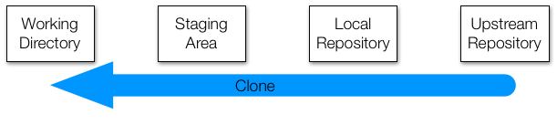

# Version Control with Git

**This tutorial is largely based on the following repositories**:

https://github.com/rdadolf/ac297r-tools-tutorial
https://github.com/cs109/2015lab1

**which were created for IACS's ac297r course, By Robert Adolf and for CS109 by Rahul Dave. Most of the credit goes to them**.

Version control is a way of tracking the change history of a project. Even if you have never used a version control tool, you've probably already done it manually: copying and renaming project folders ("paper-1.doc", "paper-2.doc", etc.) is a form of version control.

Git is a tool that automates and enhances a lot of the tasks that arise when dealing with larger, longer-living, and collaborative projects. It's also become the common underpinning to many popular online code repositories, [GitHub](https://github.com/) being the most popular.

We'll go over the basics of git, but we should point out that a *lot* of talented people have given git tutorials, and we won't do any better than they have. In fact, if you're interested in learning git deeply and have some time on your hands, I suggest you stop reading this and instead read [the Git Book](http://git-scm.com/book/en/v2). Scott Chacon and Ben Straub have done a tremendous job, and if you want to understand both the interfaces and the mechanisms behind git, this is the place to start.

In this document, we'll go over the concepts of git that are relevant to this course. **At this point, we assume you have installed git as described in Git Lab and have followed the instructions there to create ssh keys for your machine**. This enables you to use git without a pesky username-password combination. You can continue working without the SSH keys, but every time you `push` you'll be asked for your username and password, more on this below. 

----

## Why should you use version control?

If you ask 10 people, you'll get 10 different answers, but one of the commonalities is that most people don't realize how integral it is to their development process until they've started using it. Still, for the sake of argument, here are some highlights:

- ** You can undo anything: ** Git provides a *complete history* of every change that has ever been made to your project, timestamped, commented, and attributed. If something breaks, you always have the choice of going back to a previous state.
- ** You won't *need* to keep undo-ing things: ** One of the advantages of using git properly is that by keeping new changes separate from a stable base, you tend to avoid the massive rollbacks associated with constantly tinkering with a single code.
- ** You can identify exactly when and where changes were made: ** Git allows you to pinpoint when a particular piece of code was changed, so finding what other pieces of code a bug might affect or figuring out why a certain expression was added is easy.
- ** Git forces teams to face conflicts directly: ** On a team-based project, many people are often working with the same code. By having a tool which understands when and where files were changed, it's easy to see when changes might conflict with each other. While it might seem troublesome sometimes to have to deal with conflicts, the alternative&mdash;*not* knowing there's a conflict&mdash;is much more insidious.

----

## Git Basics

The first thing to understand about git is that the contents of your project are stored in several different states and forms at any given time. If you think about what version control is, this might not be surprising: in order to remember every change that's ever been made, you need to store a record of those changes *somewhere*, and to be able to handle multiple people changing the same code, you need to have different copies of the project and a way to combine them.

You can think about git operating on four different areas:

 - The **working directory** is what you're currently looking at. When you use an editor to modify a file, the changes are made to the working directory.
 - The **staging area** is a place to collect a set of changes made to your project. If you have changed three files to fix a bug, you will add all three to the staging area so that you can remember the changes as one historical entity. It is also called the **index**. You move files from the working directory to the index using the command `git add`.
 - The **local repository** is the place where git stores everything you've ever done to your project. Even when you delete a file, a copy is stored in the repo (this is necessary for always being able to undo any change). It's important to note that a local repository doesn't look much at all like your project files or directories. Git has its own way of storing all the information, and if you're curious what it looks like, look in the `.git` directory in the working directory of your project. Files are moved from the index to the local repository via the command `git commit`.
 - When working in a team, every member will be working on their own local repository. An **upstream repository** allows everyone to agree on a single version of history. If two people have made changes on their local repositories, they will combine those changes in the upstream repository. In our case this upstream repository is hosted by github. This need not be the case; SEAS provides git hosting, as do companies like Atlassian (bitbucket). This upstream repository is also called a **remote** in git parlance. The standard github remote is called the **origin**: it is the repository which is given a web page on github. One usually moves code from local to remote repositories using `git push`, and in the other direction using `git fetch`.

You can think of most git operations as moving code or metadata from one of these areas to another.

----

## Common Tasks in the version control of files.

### Forking a repository

Forking a repository done on github. It brings the repository you're forking from the existing namespace, e.g. `@datasciencelabs` to your namespace `@your-user-name`. It will ask you where you want to _fork to_, choose your own namespace. It will copy the entire repository over, and you'll have a fresh new copy. 

You will get a unique webpage for your newly minted repository.

### Cloning a repository

Now that we have a **fork** of the `cs109/Testing` repository, lets **clone** it down to our local machines.

----
`clone`

Cloning a repository does two things: it takes a repository from somewhere (usually an **upstream repository**) and makes a local copy (your new **local repository**), and it creates the most recent copy of all of the files in the project (your new **working directory**). This is generally how you will start working on a project for the first time.

Cloning a repository depends a lot on the type of repository you're using. If you're cloning out of a directory on the machine you're currently on, it's just the path to the `<project>.git` file. For github, you can clone over *ssh* using the SSH clone url in the bottom right corner of the last screenshot. This assumes you have set up your ssh keys. See `Git Lab` for how to do this if you havent done it as yet. If you havent set up your ssh keys, use *https* instead.

###Poking around

We have a nice smelling fresh repository. Lets look around it.

`log`

Each one of these "commits" is a SHA hash. It uniquely identifies all actions that have happened to this repository previously. We shall soon see how to add our own actions in. In the meanwhile, lets see the "status"of our working directory.

If you ever need help on a command, you can find the git man pages by hyphenating `git` and the command name:

----
`status`

Status is your window into the current state of your project. It can tell you which files you have changed and which files you currently have in your staging area.

----

Configuration Information is stored in a special file `config`, in a hidden folder called `.git` in your working directory. (The index and the local repository are stored there as well...more on that in  a bit)

`
cat .git/config
`

Notice that this file tells us about a remote called "origin" which is simply the github repository we cloned from. So the process of cloning left us with a remote. The file also tells us about a branch called "master", which "tracks" a remote branch valled master at "origin". 

----

Finally I set us up with a `.gitignore` file, hidden in the repository folder. It tells us what files to ignore when adding files to the index, and then comitting them to the local repository. We use this file to ignore temporary data files and such when working in our repository. Folders are indicated with a `/` at the end, in which case, all files in that folder are ignored.

`
cat .gitignore
`

You are always working on a given branch in a repository. Typically this is `master`. More on this later..You can know which branch you are on by typing `git branch`. The strred one is the one you are on.

`
git branch -avv
`

----

### Making changes

Ok! Enough poking around. Lets get down to business and add some files into our folder. Go ahead and make some changes to your directory.

----
`add`

When you've made a change to a set of files and are ready to create a commit, the first step is to add all of the changed files to the staging area. Add does that. Remember that what you see in the filesystem is your working directory, so the way to see what's in the staging area is with the `status` command. This also means that **if you add something to the staging area and then edit it again, you'll also need to add the file to the staging area again if you want to remember the new changes**.

Now our file is in the staging area (Index), waiting to be committed.

I will sometimes simply use `git add .` in the top level of the repository. This adds all new files and changed files to the index, and is particularly useful if I have created multiple new files.

----

`commit`

When you're satisfied with the changes you've added to your staging area, you can commit those changes to your local repository with the `commit` command. Those changes will have a permanent record in the repository from now on.

Every commit has two features you should be aware of. The first is a hash. This is a unique identifier for all of the information about that commit, including the code changes, the timestamp, and the author. The second is a commit message. This is text that you can (and should) add to a commit to describe what the changes were.

**Good commit messages are important.**

Commit messages are a way of quickly telling your future self (and your collaborators) what a commit was about. For even a moderately sized project, digging through tens or hundreds of commits to find the change you're looking for is a nightmare without friendly summaries.

By convention, commit messages start with a single-line summary, then an empty line, then a more comprehensive description of the changes.

[This](https://github.com/rdadolf/clangtool/commit/bdd8f1290146c28a4cb05b62ccb0ffbaaa314ff7) is an okay commit message. The changes are small, and the summary is sufficient to describe what happened.

[This](https://github.com/rdadolf/protos/commit/9fcbe1084b17027e003c62043d764ed5551ddadc) is better. The summary captures the important information (major shift, direct vs. helper), and the full commit message describes what the high-level changes were.

[This](https://github.com/rdadolf/autopaxos/commit/d43dd9b0a699c98bd142ba7cbc1836fbc4eba2ac). Don't do this.

Now we see that our branch, "`master`", has one more commit than the "`origin/master`" branch, the local copy of the branch that came from the upstream repository (nicknamed "`origin`" in this case). Let's push the changes.

----

`push`

The `push` command takes the changes you have made to your local repository and attempts to update a remote repository with them. If you're the only person working with both of these (which is how a solo GitHub project would work), then push should always succeed.

###Remotes and `fetch`ing from them

If you're working with other people, then it's possible that they have made changes to the remote repository between the time you first cloned it and now. `push` will fail. 

In our particular case of the `Testing` repository, this is not going to happen, since you just cloned it and presumably havent invited anyone to collaborate with you on it (you can do this from the settings link on the right side of the repository page). 

However you can imagine that the original repository `cs109/testing`, which you are now divorced from, has changed, and that you somehow want to pull those changes in.

That's where the next two commands come in.

---

`remote`

We have seen so far that our repository has one "remote", or upstream repository, which has been identified with the word `origin`, as seen in `.git/config`. We now wish to add another remote, which we shall call `course`, which points to the original repository we forked from. We want to do this to pull in changes, in-case something changed there.

`
git remote add course git@github.com:cs109/Testing.git
cat .git/config
`

Notice that the `master` branch only tracks the same branch on the `origin` remote. We havent set up any connection with the `course` remote as yet.

Now lets figure out how to get changes from an upstream repository, be it our `origin` upstream that a collaborator has `push`ed too, or another `course` remote to which your memory-added head TF has posted a change!

----
`fetch`

Let's say a collaborator has pushed changes to your shared upstream repository while you were editing. Their local repository and the upstream repository now both contain their changes, but your local repository does not. To update your local repository, you run `fetch`.

But what if you've committed changes in the meantime? Does your local repository contain your changes or theirs? The answer is that it contains a *record* of both, but they are kept separate. Remember that git repositories are not copies of your project files. They store all the contents of your files, along with a bunch of metadata, but in its own internal format. This is one of the reasons.

Let's say that you and your collaborator both edited the same line of the same file at the same time in different ways. On your respective machines, you both add and commit your different changes, and your collaborator pushes theirs to the upstream repository. When you run `fetch`, git adds a record of their changes to your local repository *alongside* your own. These are called *branches*, and they represent different, coexisting versions of your project. The `fetch` command adds your collaborator's branch to your local repository, but keeps yours as well.

`
git fetch course
`

You can see that a copy of a new remote branch has been made below, by providing the `-avv` argument to `git branch`.

`
git branch -avv
`

Indeed, the way git works is by creating copies of remote branches locally. Then it just compares to these "copy" branches to see what changes have been made.

----
`merge`

Having multiple branches is fine, but at some point, you'll want to combine the changes that you've made with those made by others. This is called merging.

There are two general cases when merging two branches: first, the two branches are different but the changes are in unrelated places; and second, the two branches are different and the changes are in the same locations in the same files.

The first scenario is easy. Git will simply apply both sets of changes to the appropriate places and put the resulting files into the staging area for you. Then you can commit the changes and push them back to the upstream repository. Your collaborator does the same, and everyone sees everything.

The second scenario is more complicated. Let's say the two changes set some variable to different values. Git can't know which is the correct value. One solution would be to simply use the more recent change, but this very easily leads to self-inconsistent programs. A more conservative solution, and the one git uses, is to simply leave the decision to the user. When git detects a conflict that it cannot resolve, `merge` fails, and git places a modified version of the offending file in your project directory. **This is important:** the file that git puts into your directory is not actually *either* of the originals. It is a new file that has special markings around the locations that conflicted. We shall not consider this case in this lab, deferring it to a time just before you work with other collaborators on your projects.

Lets merge in the changes from `course/master`: (The next 2-3 inputs only make sense if cs109/master is edited in-between)

`
git merge course/master
git status
`

We seem to be ahead of our upstream-tracking repository by 2 commits..why?

`
git log -3
`

Aha: one commit came from the `course` upstream, and one was a merge commit. In the case you had edited the README.md at the same time and comitted locally, you would have been asked to resolve the conflict in the merge (the second case above).

Lets push these changes to the origin now

`
git push
git status
`

You can combine a fetch and a merge together by simply doing a git `pull`. This will fail if you and your collaborator have worked on the same file (since you will have to merge by hand), but is a great shortcut when the files  worked on are different. I use it all the times on a personal level too, to shift work between two different machines, as long as I am not working on both at the same time. The usual use case is day work on a work computer, and then evening work at home on the laptop. Read the docs if you are interested.

###Branching.

As you might have seen by now, everything in git is a branch. We have branches on remote (upstream) repositories, copies of remote branches in our local repository, and branches on local repositories which (so far) track remote branches (or more precisely local copies of remote repositories)

`
git branch -avv
`

And all of these branches are nothing but commit-streams in disguise, as can be seen above. Its a very simple model which leads to a lot of interesting version control patterns.

Since branches are so light-weight, the recommended way of working on software using git is to create a new branch for each new feature you add, test it out, and if good, merge it into master. Then you deploy the software from master. But we have been using branches under the hood. Lets now lift the hood.

----
`branch`

Branches can also be created manually, and they are a useful way of organizing unfinished changes.

The `branch` command has two forms. The first:

`git branch`

simply lists all of the branches in your local repository. If you run it without having created any branches, it will list only one, called `master`. This is the default branch. You have seen the use of `git branch -avv` to show all branches.

The other form creates a branch with a given name:

It's important to note that the other branch is not *active*. If you make changes, they will still apply to the `master` branch, not `my-new-branch`. To change this, you need the next command.

----
`checkout`

Checkout switches the active branch. Since branches can have different changes, `checkout` may make the working directory look very different. For instance, if you have added new files to one branch, and then check another branch out, those files will no longer show up in the directory. They are still stored in the `.git` folder, but since they only exist in the other branch, they cannot be accessed until you check out the original branch.

You can combine creating a new branch and checking it out with the shortcut:

Ok so lets try this out on our repository....

`
git branch mybranch1
`

See what branches we have created...

`
git branch 
`

Jump onto the `mybranch1` branch...

`
git checkout mybranch1
git branch
`

###Recovering from a mistake

*This is a bit more advanced, so be careful about this part or go to your TA for more help with this.* 

Now suppose for a second that this `mybranch1` was created by someone else. We wanted to get it down using `fetch` and play. But we called `pull`, which did an automatic merge for us.

`
git pull origin mybranch1
`

`
git status
`

oops, that was not what we wanted. We undo it using `git reset`, to go back to the state at the last commit.

`
git reset --hard origin/master
`

`
git status
`

###Changing only one file

*This is ALSO a bit more advanced, so be careful about this part or go to your TA for more help with this.* 

The last git command I want to talk about, since it might come handy in the course, is the situation in which you dont want to merge an entire branch from the upstream, but just one file from it. There is a direct use case for it. Indeed, suppose I've made an error in this lab and want to correct it. So i fix it in the upstream. In the meanwhile you have edited some other files. You dont care to manually ignore my older copies of those files. So you want to fix just one file from this new branch. This is how you do it.

First you fetch from the remote (i ought to be doing this with the course remote but just want to illustrate it here)

`
git fetch origin
`

`
git branch -avv
`

`
git checkout origin/mybranch1 -- world.md
`

Why does the syntax have `origin/mybranch1`? Remember that multiple remotes may have the same branch...so you want to be specific. So we check out `origin`'s `mybranch1`, and only want `world.md`.

`
git status
`

Note that the file as automatically added to the index. We'll commit and push.

`
git commit -m "want world in master" 
`

`
git status
`

`
git push
`

Note that in git versions > 2.0, which you must use, `git push` will push the current branch to its appropriate remote, all of which can be seen through `git branch -avv` or by looking at the `config` file.

`
cat .git/config
`

----

## Git habits

** * Commit early, commit often. * **

Git is more effective when used at a fine granularity. For starters, you can't undo what you haven't committed, so committing lots of small changes makes it easier to find the right rollback point. Also, merging becomes a lot easier when you only have to deal with a handful of conflicts.

** * Commit unrelated changes separately. * **

Identifying the source of a bug or understanding the reason why a particular piece of code exists is much easier when commits focus on related changes. Some of this has to do with simplifying commit messages and making it easier to look through logs, but it has other related benefits: commits are smaller and simpler, and merge conflicts are confined to only the commits which actually have conflicting code.

** * Do not commit binaries and other temporary files. * **

Git is meant for tracking changes. In nearly all cases, the only meaningful difference between the contents of two binaries is that they are different. If you change source files, compile, and commit the resulting binary, git sees an entirely different file. The end result is that the git repository (which contains a complete history, remember) begins to become bloated with the history of many dissimilar binaries. Worse, there's often little advantage to keeping those files in the history. An argument can be made for periodically snapshotting working binaries, but things like object files, compiled python files, and editor auto-saves are basically wasted space.

** * Ignore files which should not be committed * **

Git comes with a built-in mechanism for ignoring certain types of files. Placing filenames or wildcards in a `.gitignore` file placed in the top-level directory (where the `.git` directory is also located) will cause git to ignore those files when checking file status. This is a good way to ensure you don't commit the wrong files accidentally, and it also makes the output of `git status` somewhat cleaner.

** * Always make a branch for new changes * **

While it's tempting to work on new code directly in the `master` branch, it's usually a good idea to create a new one instead, especially for team-based projects. The major advantage to this practice is that it keeps logically disparate change sets separate. This means that if two people are working on improvements in two different branches, when they merge, the actual workflow is reflected in the git history. Plus, explicitly creating branches adds some semantic meaning to your branch structure. Moreover, there is very little difference in how you use git.

** * Write good commit messages * **

I cannot understate the importance of this.

** Seriously. Write good commit messages. **

